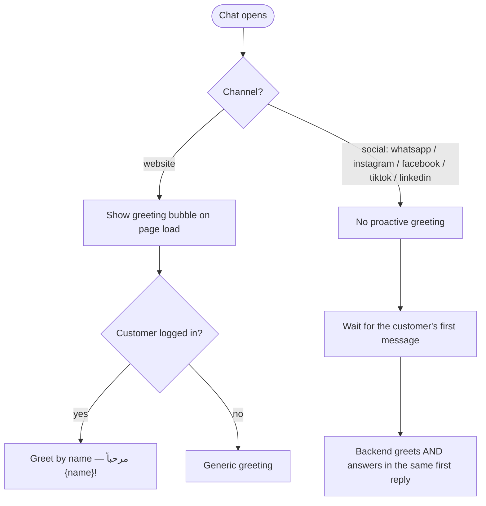
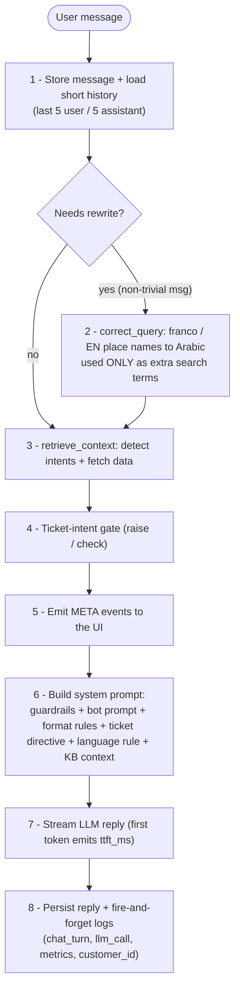
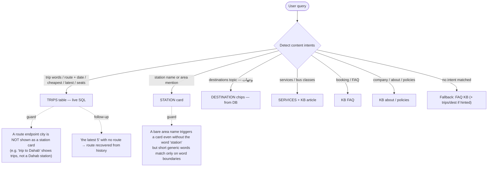
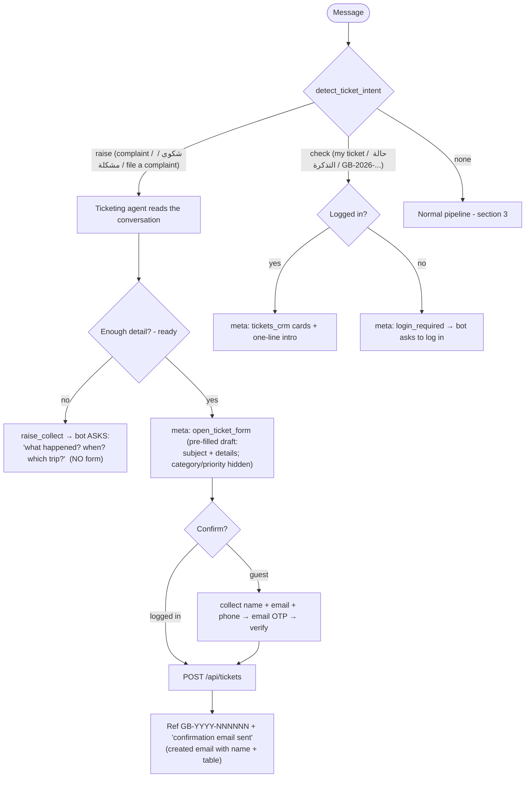
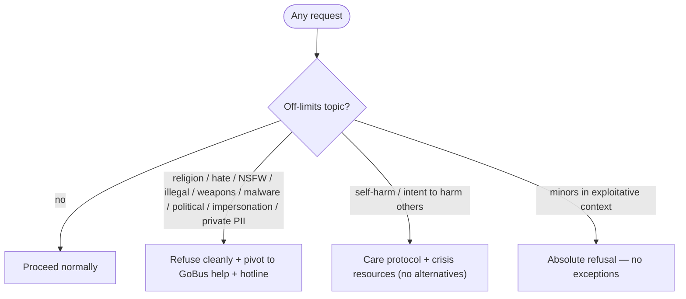
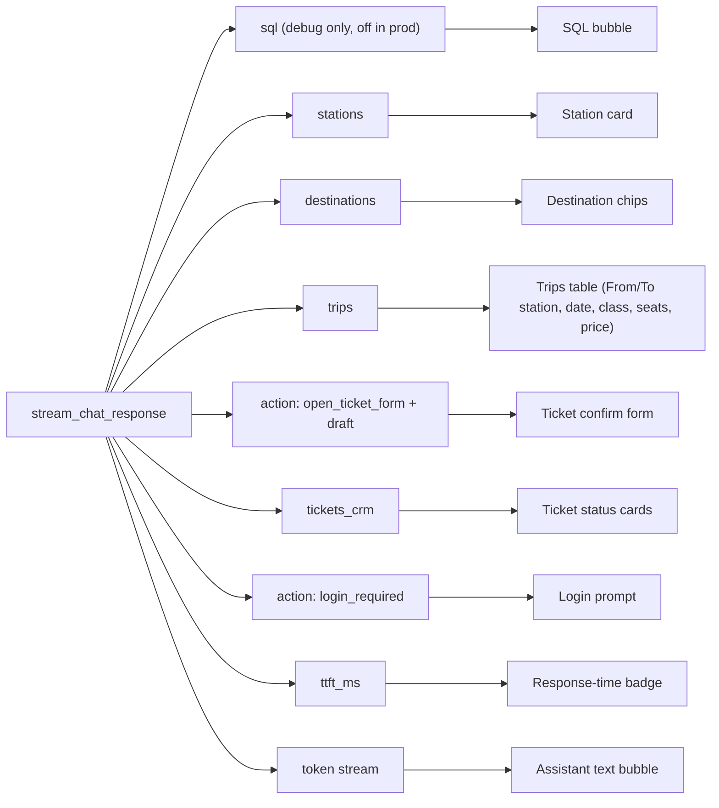
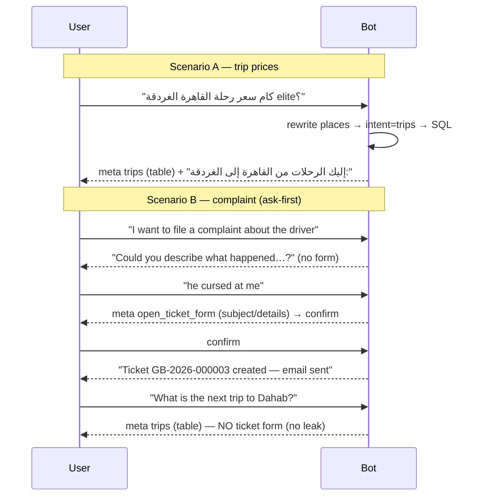

# GoBus Chatbot — Conversation Flow & Logic

This document maps the full runtime behaviour of the bot: what happens for any
message, which branch it takes, and **when it says what (and when it doesn't)**.

> Diagrams are [Mermaid](https://mermaid.js.org/). They render automatically on
> GitHub and in VS Code (with a Mermaid preview extension).

Source of truth in code:
- `backend/app/services/chat_service.py` — the per-message pipeline
- `backend/app/services/kb_retrieval.py` — intent detection + data fetching
- `backend/app/services/ticketing_agent.py` + `ticket_intent.py` — tickets
- `backend/app/core/guardrails.py` — hard refusals
- `frontend/src/components/chat/*` — deterministic rendering of cards/tables

---

## 1. Conversation start — greeting (channel-aware)

- **Website** = proactive greeting on load, personalized when logged in.
- **Social** = message-triggered: the bot greets on the first inbound message,
  then answers it in the same reply (greeting alone, or greeting + answer).

---

## 2. Per-message pipeline (runs for every message)

> The **original** message always drives intent + the answer. A bad rewrite can
> only add place-matching terms — it can never change *what kind* of answer you get.

---

## 3. Intent routing — what kind of answer you get

Each matched intent fetches structured data and emits a **meta** event; the
model is told that data is shown and to write only a one-line intro.

---

## 4. Ticket sub-flow (agentic complaint / follow-up)

> The raise flow only continues from the **immediately preceding** turn — an
> earlier, already-handled complaint can't hijack a later unrelated question
> (and a trip/station/destination query is never treated as a complaint).

---

## 5. Guardrails (hard refusals — server-side, override everything)

---

## 6. Meta events → what renders in the UI

Order emitted: `ticket → sql → stations → destinations → trips → (social greeting) → tokens`.

---

## 7. When it says what — and when it doesn't

| Situation | It SAYS | It does NOT say |
|---|---|---|
| Trips / stations / destinations found | one short intro line ("Here are the trips…", "تفضل تفاصيل المحطة:") | never re-lists rows; never invents trips/prices/stations |
| Station resolved (incl. city → main station) | affirms + shows the card | never "I can't provide / check the app" |
| No trips for that route | "no trips" + suggested alternatives | doesn't fabricate trips |
| KB question with context | answers from KB (headers/bullets) | doesn't invent facts beyond KB |
| GoBus detail it doesn't have | says so + offers the hotline | doesn't guess |
| Complaint without details | asks "what happened?" first | doesn't open a ticket yet |
| Off-limits topic | refuses + pivots to travel help | no "educational/neutral" reframings |
| Hotline mentioned | bold **{hotline}** from `BotSettings` (single source) | no hardcoded number |
| Language | replies in the user's language (AR / EN) | — |

---

## 8. Two worked scenarios

